NYSERDA Solar Project EDA & Cost Prediction
================

All data was retrieved from
[DATA.NY.GOV](https://data.ny.gov/Energy-Environment/Solar-Electric-Programs-Reported-by-NYSERDA-Beginn/3x8r-34rs).
Description of the data set can be found in the above link as well.

## Data Preparation

To begin this data analysis I have read in the downloaded csv file from
the above link.

I have limited projects to the following criteria

- Projects completed in 2019

- Completed projects; pipeline projects do not have a populated value

- Projects with \> \$0 cost

- Residential only; not enough commercial projects for a reliable sample
  and may skew projections and predictions

I have pared down to only the most populated and reliable fields and
consolidated values for `primary_inverter_manufacturer` and
`primary_pv_module_manufacturer`. I replace a few NA and values with 0
or “Unk” for “unknown” and format the date fields.

``` r
library(tidyverse,quietly = T)
```

    ## ── Attaching core tidyverse packages ──────────────────────── tidyverse 2.0.0 ──
    ## ✔ dplyr     1.1.2     ✔ readr     2.1.4
    ## ✔ forcats   1.0.0     ✔ stringr   1.5.0
    ## ✔ ggplot2   3.4.2     ✔ tibble    3.2.1
    ## ✔ lubridate 1.9.2     ✔ tidyr     1.3.0
    ## ✔ purrr     1.0.1     
    ## ── Conflicts ────────────────────────────────────────── tidyverse_conflicts() ──
    ## ✖ dplyr::filter() masks stats::filter()
    ## ✖ dplyr::lag()    masks stats::lag()
    ## ℹ Use the conflicted package (<http://conflicted.r-lib.org/>) to force all conflicts to become errors

``` r
library(janitor,quietly = T)
```

    ## 
    ## Attaching package: 'janitor'
    ## 
    ## The following objects are masked from 'package:stats':
    ## 
    ##     chisq.test, fisher.test

``` r
library(lubridate,quietly = T)


SEP = read_csv("Solar_Electric_Programs_Reported_by_NYSERDA__Beginning_2000.csv") %>% 
  clean_names() %>% 
  filter(project_status == "Complete" & 
           sector == "Residential" & 
           project_cost > 0 &
           expected_k_wh_annual_production > 0 &
           #excluding bad data
           project_cost != 207810.62
         )
```

    ## Rows: 142171 Columns: 38
    ## ── Column specification ────────────────────────────────────────────────────────
    ## Delimiter: ","
    ## chr (28): Reporting Period, Project Number, Legacy Project Number, Street Ad...
    ## dbl (10): ZIP Code, Census Tract, Total Inverter Quantity, Total PV Module Q...
    ## 
    ## ℹ Use `spec()` to retrieve the full column specification for this data.
    ## ℹ Specify the column types or set `show_col_types = FALSE` to quiet this message.

``` r
SEP = SEP %>% select(county,municipality_type,
                     electric_utility,purchase_type,date_application_received,date_completed,
                     contractor,total_inverter_quantity,total_pv_module_quantity,
                     primary_inverter_manufacturer,primary_pv_module_manufacturer,latitude,longitude,
                     project_cost,incentive,total_nameplate_k_w_dc,expected_k_wh_annual_production) %>% 
  mutate(
         primary_pv_module_manufacturer= replace_na(primary_pv_module_manufacturer,"Unk"),
         primary_inverter_manufacturer = replace_na(primary_inverter_manufacturer,"Unk"),
         primary_inverter_manufacturer = fct_lump(primary_inverter_manufacturer, prop=0.05, other_level="Other"),
         primary_pv_module_manufacturer = fct_lump(primary_pv_module_manufacturer, prop=0.05, other_level="Other"),
         
         incentive = replace_na(incentive,0),
         date_application_received =  as.Date(date_application_received,format="%m/%d/%Y"),
         date_completed =  as.Date(date_completed,format="%m/%d/%Y"),
         project_duration = as.integer(difftime(date_completed,date_application_received,units = "days"))
         ) %>% 
  filter(year(date_completed) == 2019) %>% 
  drop_na()

str(SEP)
```

    ## tibble [10,047 × 18] (S3: tbl_df/tbl/data.frame)
    ##  $ county                         : chr [1:10047] "Nassau" "Kings" "Nassau" "Erie" ...
    ##  $ municipality_type              : chr [1:10047] "Town" "City" "Town" "Town" ...
    ##  $ electric_utility               : chr [1:10047] "Long Island Power Authority" "Consolidated Edison" "Long Island Power Authority" "NYS Electric and Gas" ...
    ##  $ purchase_type                  : chr [1:10047] "Purchase" "Purchase" "Purchase" "Purchase" ...
    ##  $ date_application_received      : Date[1:10047], format: "2018-09-26" "2019-10-09" ...
    ##  $ date_completed                 : Date[1:10047], format: "2019-01-31" "2019-10-17" ...
    ##  $ contractor                     : chr [1:10047] "SuNation Solar Systems, Inc." "Brooklyn SolarWorks, LLC" "SuNation Solar Systems, Inc." "Solcius, LLC" ...
    ##  $ total_inverter_quantity        : num [1:10047] 1 1 1 1 7 1 9 1 10 27 ...
    ##  $ total_pv_module_quantity       : num [1:10047] 20 6 16 13 7 29 9 25 10 27 ...
    ##  $ primary_inverter_manufacturer  : Factor w/ 8 levels "ABB","Enphase Energy",..: 6 4 6 6 3 6 3 6 7 3 ...
    ##  $ primary_pv_module_manufacturer : Factor w/ 6 levels "Canadian Solar",..: 6 3 6 6 6 6 3 6 6 6 ...
    ##  $ latitude                       : num [1:10047] 40.7 40.7 40.7 42.8 40.6 ...
    ##  $ longitude                      : num [1:10047] -73.5 -74 -73.7 -78.6 -73.9 ...
    ##  $ project_cost                   : num [1:10047] 36500 26463 20678 16193 7389 ...
    ##  $ incentive                      : num [1:10047] 0 666 0 611 640 0 696 0 488 0 ...
    ##  $ total_nameplate_k_w_dc         : num [1:10047] 7.1 2.22 5.76 3.97 2.14 10.3 3.02 8.88 2.5 9.72 ...
    ##  $ expected_k_wh_annual_production: num [1:10047] 8146 2497 6695 2233 2393 ...
    ##  $ project_duration               : int [1:10047] 127 8 109 64 57 95 64 48 34 55 ...

## Statistical

Here is a readout of the statistics from each numeric field

``` r
SEP %>% select_if(is.numeric) %>%  pastecs::stat.desc() %>% round(2) %>% rownames_to_column() %>%
  filter(!str_detect(rowname,"nbr")) %>% 
  as_tibble() %>%
  knitr::kable(align = "l",format.args = list(big.mark = ","),format = "pipe") 
```

| rowname      | total_inverter_quantity | total_pv_module_quantity | latitude   | longitude   | project_cost   | incentive     | total_nameplate_k\_w_dc | expected_k\_wh_annual_production | project_duration |
|:-------------|:------------------------|:-------------------------|:-----------|:------------|:---------------|:--------------|:------------------------|:---------------------------------|:-----------------|
| min          | 0.00                    | 0.00                     | 40.50      | -79.62      | 2,188.00       | 0.00          | 0.28                    | 302.00                           | 0.00             |
| max          | 172.00                  | 108.00                   | 44.86      | -72.23      | 135,733.00     | 9,945.00      | 33.12                   | 38,802.00                        | 1,225.00         |
| range        | 172.00                  | 108.00                   | 4.36       | 7.39        | 133,545.00     | 9,945.00      | 32.84                   | 38,500.00                        | 1,225.00         |
| sum          | 114,514.00              | 228,253.00               | 415,121.49 | -747,936.55 | 285,817,468.27 | 20,672,062.00 | 74,602.13               | 78,303,219.00                    | 852,883.00       |
| median       | 6.00                    | 20.00                    | 40.85      | -73.90      | 26,204.00      | 1,739.00      | 6.62                    | 6,927.00                         | 66.00            |
| mean         | 11.40                   | 22.72                    | 41.32      | -74.44      | 28,448.04      | 2,057.54      | 7.43                    | 7,793.69                         | 84.89            |
| SE.mean      | 0.13                    | 0.12                     | 0.01       | 0.01        | 131.22         | 13.78         | 0.04                    | 40.45                            | 0.70             |
| CI.mean.0.95 | 0.25                    | 0.23                     | 0.02       | 0.03        | 257.21         | 27.00         | 0.08                    | 79.28                            | 1.38             |
| var          | 165.88                  | 138.91                   | 0.83       | 2.00        | 172,986,531.58 | 1,906,771.87  | 14.74                   | 16,435,888.20                    | 4,961.82         |
| std.dev      | 12.88                   | 11.79                    | 0.91       | 1.41        | 13,152.43      | 1,380.86      | 3.84                    | 4,054.12                         | 70.44            |
| coef.var     | 1.13                    | 0.52                     | 0.02       | -0.02       | 0.46           | 0.67          | 0.52                    | 0.52                             | 0.83             |

Additionally, I create a table of the rankings by project amount and
project count for each contractor. I will utilize this table later on
during data visualization to include only top n contractors. We can see
that SunRun is by far the largest in both dollar and project volume.

``` r
rankings = SEP %>% group_by(contractor) %>% 
  summarise(project_ttl = sum(project_cost),n=n()) %>% 
  arrange(desc(n)) %>% 
  mutate(rnk_dollar = dense_rank(desc(project_ttl)),rnk_n = dense_rank(desc(n)))

knitr::kable(head(rankings,15),align = "l",format.args = list(big.mark = ","),format = "pipe")
```

| contractor                                      | project_ttl | n     | rnk_dollar | rnk_n |
|:------------------------------------------------|:------------|:------|:-----------|:------|
| SunRun Inc.                                     | 49,231,252  | 2,243 | 1          | 1     |
| SunPower Capital LLC                            | 40,825,535  | 1,186 | 2          | 2     |
| Venture Home Solar LLC                          | 20,882,086  | 790   | 3          | 3     |
| SuNation Solar Systems, Inc.                    | 13,705,784  | 447   | 4          | 4     |
| Vivint Solar Development LLC                    | 8,298,089   | 343   | 9          | 5     |
| Solcius, LLC                                    | 9,362,510   | 342   | 6          | 6     |
| Kasselman Solar LLC                             | 8,804,529   | 303   | 7          | 7     |
| PlugPV, LLC                                     | 9,688,047   | 268   | 5          | 8     |
| Momentum Solar (dba for Pro Custom Solar LLC)   | 5,763,926   | 239   | 11         | 9     |
| Brooklyn SolarWorks, LLC                        | 8,631,090   | 236   | 8          | 10    |
| Trinity Solar (dba for Trinity Heating and Air) | 5,786,394   | 207   | 10         | 11    |
| Sunnova Energy Corp.                            | 5,090,358   | 204   | 14         | 12    |
| Solar Liberty Energy Systems, Inc.              | 5,032,064   | 188   | 15         | 13    |
| Tesla Energy Operations Inc.                    | 5,470,699   | 170   | 13         | 14    |
| IGS Solar, LLC                                  | 3,684,700   | 165   | 19         | 15    |

## Data Visualization

SunRun has the highest aggregate project costs, as previously mentioned.
The top 3, SunRun, SunPower Capital, and Venture Home Solar seem to
dominate the market.

``` r
ggplot(SEP %>% group_by(contractor) %>% 
         summarise(project_cost = sum(project_cost)) %>% 
         arrange(desc(project_cost)) %>% 
         head(15)
       ) +
  aes(
    x = reorder(contractor,-project_cost),
    y = project_cost
   #, fill= electric_utility
  ) +
  geom_col() +
  scale_y_continuous(label = scales::dollar_format(suffix = "M",scale =  1e-7)) +
  scale_x_discrete(guide = guide_axis(angle = 30)) +
  labs(
    x = "Contractor",
    y = "Costs",
    title = "Project Cost Total by Contractor",
    subtitle = "Top 15 by Project Amount"
  ) +
  theme_bw()
```

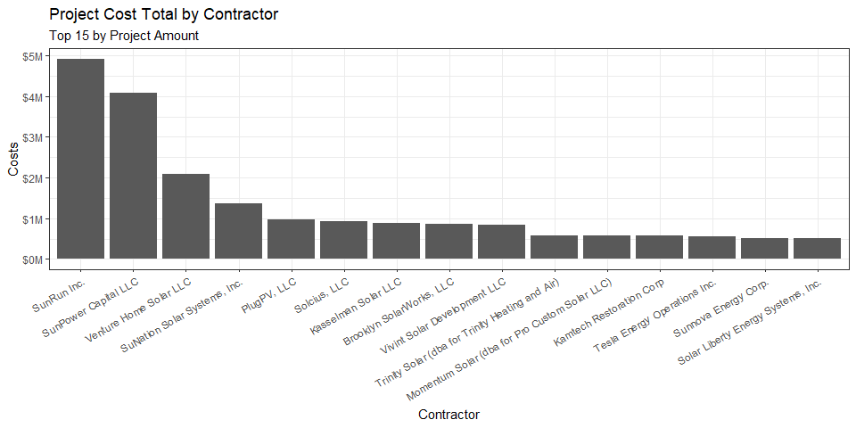<!-- -->

To further illustrate the concentration to the top 3 contractors (and
SunRun in particular), the number of projects and PV modules installed
is also far ahead of the competition.

``` r
ggplot(SEP %>% group_by(contractor) %>% 
    summarise(`Photovoltaic (PV) Modules` = sum(total_pv_module_quantity),Projects=n()) %>% 
    arrange(desc(`Photovoltaic (PV) Modules`)) %>% 
    head(15) %>% pivot_longer(-contractor)) +
  aes(
    x = reorder(contractor,-value),
    y = value
   , fill= name
  ) +
  geom_bar(position="dodge", stat="identity") +
  scale_y_continuous(label = scales::comma_format(),trans="sqrt") +
  scale_x_discrete(guide = guide_axis(angle = 30)) +
  labs(
    x = "Contractor",
    y = "Frequency",
    title = "Project Photovoltaic Module (PV) Installs and Projects by Contractor (Scaled)",
    subtitle = "Top 10 by PV Amount",
    fill = "Metric"
  ) +
  theme_bw()
```

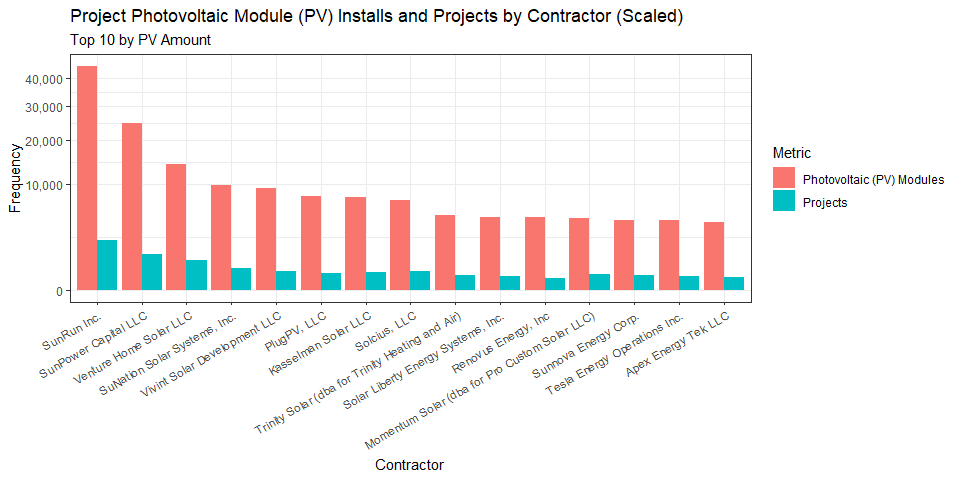<!-- -->

However, these top 3 don’t even appear on the list of top 15 average
project costs

``` r
ggplot(SEP %>% group_by(contractor) %>% 
         summarise(project_cost = mean(project_cost)) %>% 
         arrange(desc(project_cost)) %>% 
         head(15)
       ) +
  aes(
    x = reorder(contractor,-project_cost),
    y = project_cost
  ) +
  geom_col() +
  scale_y_continuous(label = scales::dollar_format()) +
  scale_x_discrete(guide = guide_axis(angle = 30)) +
  labs(
    x = "Contractor",
    y = "Project Costs",
    title = "Average Cost per Project by Contractor",
    subtitle = "Top 15 by Project Amount Avg"
  ) +
  theme_bw()
```

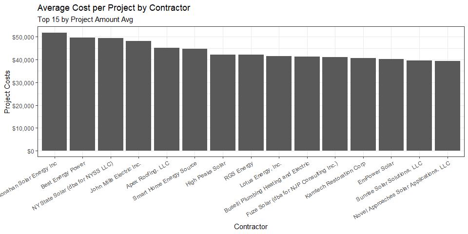<!-- -->

A more normalized measure of cost is the project cost in relation to the
number of PV modules installed. Said another way, this is the price at
which a contractor can install a PV module on average. Below are the 15
highest.

``` r
ggplot(SEP %>% group_by(contractor) %>% 
         summarise(cost_to_module = sum(project_cost)/sum(total_pv_module_quantity),
                   n = n()) %>% 
         filter(n >= 10) %>% 
         arrange(desc(cost_to_module)) %>% 
         head(15)
       ) +
  aes(
    x = reorder(contractor,-cost_to_module),
    y = cost_to_module
  ) +
  geom_col() +
  scale_y_continuous(label = scales::dollar_format()) +
  scale_x_discrete(guide = guide_axis(angle = 60)) +
  labs(
    x = "Contractor",
    y = "Project Costs",
    title = "Average Cost per Photovoltaic (PV) Module Installed by Contractor",
    subtitle = "Highest 15 by Cost / Module (minimum 10 projects)"
  ) +
  theme_bw()
```

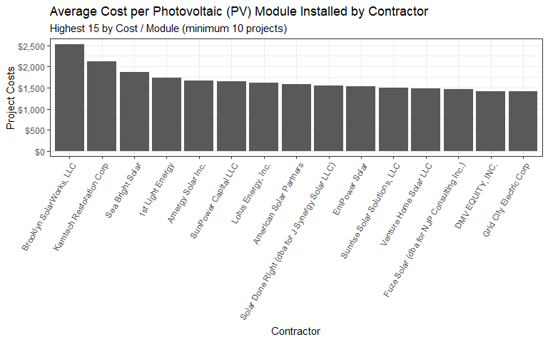<!-- -->

Conversely, the 15 lowest

``` r
ggplot(SEP %>% group_by(contractor) %>% 
         summarise(cost_to_module = sum(project_cost)/sum(total_pv_module_quantity),
                   n = n()) %>% 
         filter(n >= 10) %>% 
         arrange(cost_to_module) %>% 
         head(15)
       ) +
  aes(
    x = reorder(contractor,cost_to_module),
    y = cost_to_module
  ) +
  geom_col() +
  scale_y_continuous(label = scales::dollar_format()) +
  scale_x_discrete(guide = guide_axis(angle = 60)) +
  labs(
    x = "Contractor",
    y = "Project Costs",
    title = "Average Cost per Photovoltaic (PV) Module Installed by Contractor",
    subtitle = "Lowest 15 by Cost / Module (minimum 10 projects)"
  ) +
  theme_bw()
```

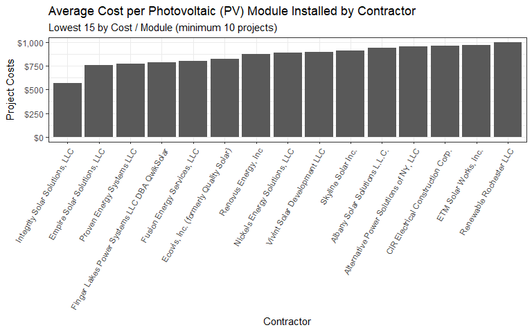<!-- -->

### Distributions

``` r
ggplot(SEP) +
  aes(x = project_cost) +
  geom_histogram( fill = "#737373",binwidth = 1000) +
  scale_y_continuous(label = scales::comma_format()) +
  scale_x_continuous(label = scales::comma_format()) +
  labs(
    x = "Project Cost",
    y = "Freq",
    title = "Project Cost Distribution"
  ) +
  theme_bw()
```

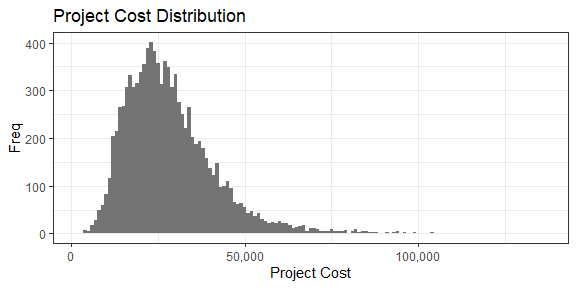<!-- -->

``` r
ggplot(SEP) +
  aes(x = expected_k_wh_annual_production) +
  geom_histogram( fill = "#737373",binwidth = 1000) +
  scale_y_continuous(label = scales::comma_format()) +
  scale_x_continuous(label = scales::comma_format()) +
  labs(
    x = "Expected Output (kWh)",
    y = "Freq",
    title = "Project kWh Output Distribution"
  ) +
  theme_bw()
```

<!-- -->

``` r
ggplot(SEP) +
  aes(x = project_duration) +
  geom_histogram( fill = "#737373",binwidth = 10) +
  scale_y_continuous(label = scales::comma_format()) +
  scale_x_continuous(label = scales::comma_format()) +
  labs(
    x = "Project Duration (Days)",
    y = "Freq",
    title = "Project Duration Distribution"
  ) +
  theme_bw()
```

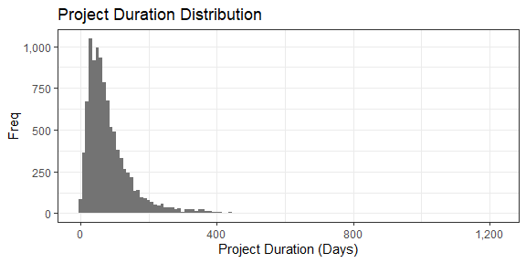<!-- -->
\### Correlations

Now that we can see the distributions above, we can now move onto
correlation visualizations. Below is a graph representing the
relationship between project cost and time. I was surprised at the
absence of a tighter positive correlation.

``` r
ggplot(SEP) +
  aes(
    x = project_duration,
    y = project_cost,
    colour = total_pv_module_quantity
  ) +
  geom_point( size = 1.5) +
  scale_color_viridis_c(option = "inferno", direction = 1) +
  scale_y_continuous(label = scales::dollar_format()) +
  scale_x_continuous(label = scales::comma_format()) +
  labs(
    x = "Project Duration (Days)",
    y = "Project Cost",
    title = "Project Cost x Duration",
    color = "Photovoltaic (PV) Modules"
  ) +
  theme_bw()
```

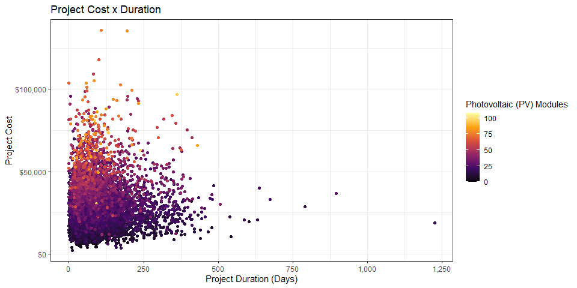<!-- -->

The next graph, below, represents the relationship between project cost
and PV modules installed. Quadrant II, the upper left portion, would
display projects that would be considered highly cost effective; project
cost was lower when the number of modules was relatively high.
Conversely, quadrant IV would represent low cost effectiveness.
Additionally, the color of the expected output (visualized as color in
this graph) would be another measure to consider.

``` r
ggplot(SEP) +
  aes(
    x = project_cost,
    y = total_pv_module_quantity,
    colour = expected_k_wh_annual_production/1000
  ) +
  geom_point(shape = "circle", size = 1.5) +
  scale_color_distiller(palette = "Set1", direction = 1) +
   scale_x_continuous(label = scales::dollar_format()) +
  scale_y_continuous(label = scales::comma_format()) +
  labs(
    x = "Project Cost",
    y = "Photovoltaic (PV) Modules",
    title = "Project Cost x Photovoltaic (PV) Modules",color = "Expected Output (kWh; thousands)"
  ) +
  theme_bw() +
  theme(legend.position = "top")
```

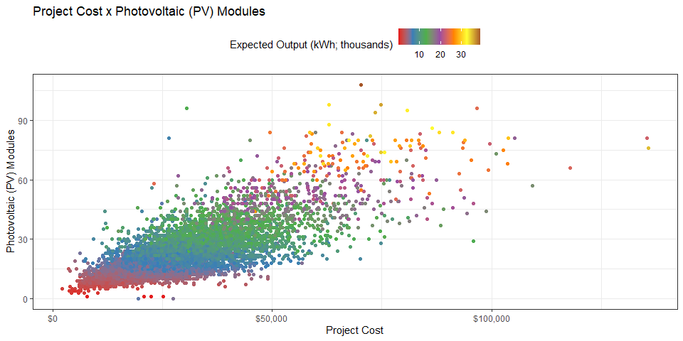<!-- -->

Using the coordinates, I plot each project by cost geographically.

``` r
library(sf)
```

    ## Warning: package 'sf' was built under R version 4.3.1

    ## Linking to GEOS 3.11.2, GDAL 3.6.2, PROJ 9.2.0; sf_use_s2() is TRUE

``` r
my_sf <- st_as_sf(SEP, coords = c('longitude', 'latitude'))


ggplot(my_sf) + 
  geom_sf(aes(color = project_cost/1000))+
    scale_color_viridis_c(option = "inferno", direction = 1) +
  labs(
    x = "Latitude",
    y = "Longitude",
    title = "Project Cost by Region of NY",color = "Project Cost (Thousands)"
  ) +
  theme_bw()
```

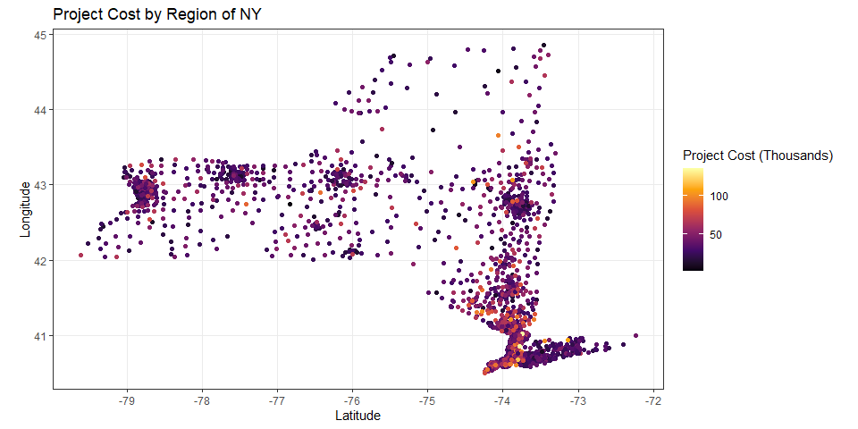<!-- -->

## Cost Prediction Model

### Preprocessing

The next step is project cost prediction. First I will plot the
correlations between the numeric attributes.

Most of the features are highly correlated, outside of
`total_inverter_quantiy` (which I also suspect contains erroneous data)
which is removed later on.

``` r
library(corrplot,quietly = T)
```

    ## corrplot 0.92 loaded

``` r
corrplot(cor(SEP %>%  select(is.numeric,-c(latitude,longitude))), method="number",type="lower", order="hclust",number.cex = 1, tl.cex = 1)
```

    ## Warning: Use of bare predicate functions was deprecated in tidyselect 1.1.0.
    ## ℹ Please use wrap predicates in `where()` instead.
    ##   # Was:
    ##   data %>% select(is.numeric)
    ## 
    ##   # Now:
    ##   data %>% select(where(is.numeric))
    ## This warning is displayed once every 8 hours.
    ## Call `lifecycle::last_lifecycle_warnings()` to see where this warning was
    ## generated.

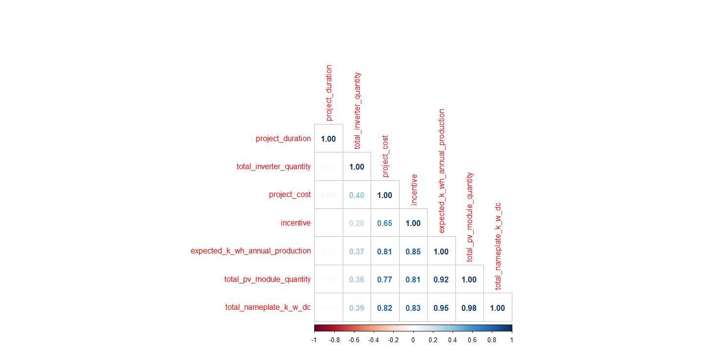<!-- -->

Here I apply the steps to prepare the data for training and testing. As
mentioned, I remove inverter quantity along with a handful of other
fields, such as date completed and duration, which we would have no way
of knowing if we were to apply the model to an existing pipeline
project.

I apply principal component analysis (PCA) to
`expected_k_wh_annual_production`,`total_pv_module_quantity`, and
`total_nameplate_k_w_dc` due to their high multicollinearity. I include
`latitude` and `longitude` features without transforming and one-hot
encode `contractor` (after lumping infrequent values together with
`fct_lump` during the split) and component manufacturers.

``` r
library(tidymodels,quietly = T)
```

    ## ── Attaching packages ────────────────────────────────────── tidymodels 1.1.0 ──

    ## ✔ broom        1.0.4     ✔ rsample      1.1.1
    ## ✔ dials        1.2.0     ✔ tune         1.1.1
    ## ✔ infer        1.0.4     ✔ workflows    1.1.3
    ## ✔ modeldata    1.1.0     ✔ workflowsets 1.0.1
    ## ✔ parsnip      1.1.0     ✔ yardstick    1.2.0
    ## ✔ recipes      1.0.6

    ## ── Conflicts ───────────────────────────────────────── tidymodels_conflicts() ──
    ## ✖ scales::discard() masks purrr::discard()
    ## ✖ dplyr::filter()   masks stats::filter()
    ## ✖ recipes::fixed()  masks stringr::fixed()
    ## ✖ dplyr::lag()      masks stats::lag()
    ## ✖ yardstick::spec() masks readr::spec()
    ## ✖ recipes::step()   masks stats::step()
    ## • Dig deeper into tidy modeling with R at https://www.tmwr.org

``` r
ml_df = initial_time_split(
  SEP %>% 
    mutate(contractor = fct_lump(contractor, prop=.02, other_level="Other")) %>% 
    arrange(date_application_received),
  prop = 0.80
)


preprocessing_recipe =
  recipes::recipe(project_cost  ~ ., data = training(ml_df)) %>%
  step_select(-c("county","electric_utility","total_inverter_quantity","incentive",
                 "date_application_received","date_completed","project_duration")) %>% 
  step_dummy(all_factor(),one_hot = T) %>%
  step_pca("expected_k_wh_annual_production","total_pv_module_quantity", "total_nameplate_k_w_dc",
           keep_original_cols = F) %>%
  prep()


train_proc = recipes::bake(
  preprocessing_recipe, 
  new_data = training(ml_df)
)

test_proc = recipes::bake(
  preprocessing_recipe,
  new_data = testing(ml_df)
)
```

### Model Specifications and Fit

Using xgBoost, I specify the number of trees and learning rate and fit
the model.

``` r
model = parsnip::boost_tree(trees = 4000,learn_rate = .01)  %>%
  set_engine("xgboost") %>%
  set_mode("regression")

model_fit =
  model %>%
  fit(project_cost ~.,train_proc)
```

### Predictions & Model Evaluation

First, I predict the new values and add back to the test portion of my
data. I stratify the projects by cost into 10 quantiles, which I will
reference later.

``` r
test_pred = model_fit %>% predict(test_proc) %>% 
  as.data.frame() %>% rename(cost_prediction = 1) %>%  
  bind_cols(testing(ml_df)) %>% 
  mutate(cost_prediction = cost_prediction,
         delta = (cost_prediction-project_cost)/project_cost,
         ntile = ntile(project_cost,10)
         )
```

I then calculate three metrics on the overall results - mean percentage
error, mean absolute percentage error, and mean absolute error.

Overall, the model was \~13.67% off on average and \~\$3,600 off in
absolute terms on a project to project basis.

``` r
multi_metric <- metric_set(mpe, mape, mae)

test_pred %>% 
  multi_metric(project_cost,cost_prediction) %>%
  knitr::kable(align = "l",format.args = list(big.mark = ","),format = "pipe")
```

| .metric | .estimator | .estimate    |
|:--------|:-----------|:-------------|
| mpe     | standard   | -3.424132    |
| mape    | standard   | 13.664447    |
| mae     | standard   | 3,615.841523 |

If we total the actual costs vs the predicted cost, overall the
predictions are only off by 0.06%.

``` r
test_pred %>% summarise(actual = sum(project_cost),pred = sum(cost_prediction)) %>% 
  mutate(pct_error = (pred-actual)/actual) %>%
  knitr::kable(align = "l",format.args = list(big.mark = ","),format = "pipe")
```

| actual     | pred       | pct_error  |
|:-----------|:-----------|:-----------|
| 57,453,711 | 57,079,813 | -0.0065078 |

As mentioned above, I assigned each project a quantile. Below are the
quantile numbers and statistics. Notice the 1st and 10th quantile have
the largest ranges.

``` r
test_pred %>% 
  group_by(ntile) %>% 
  summarise(range_begn = min(project_cost),
            range_end = max(project_cost),
            size = range_end - range_begn,
            median = median(project_cost),
            mean = mean(project_cost),
            std_dev = sd(project_cost)
            ,projects = n()) %>%
   knitr::kable(align = "l",format.args = list(big.mark = ","),format = "pipe")
```

| ntile | range_begn | range_end  | size      | median   | mean      | std_dev     | projects |
|:------|:-----------|:-----------|:----------|:---------|:----------|:------------|:---------|
| 1     | 3,800.00   | 13,870.00  | 10,070.00 | 11,825.5 | 11,200.29 | 2,158.7169  | 201      |
| 2     | 13,882.40  | 17,249.58  | 3,367.18  | 15,698.1 | 15,627.69 | 967.1655    | 201      |
| 3     | 17,250.00  | 20,823.60  | 3,573.60  | 19,013.0 | 18,917.89 | 1,047.7497  | 201      |
| 4     | 20,851.20  | 23,500.00  | 2,648.80  | 22,116.0 | 22,132.66 | 784.8599    | 201      |
| 5     | 23,517.00  | 26,705.00  | 3,188.00  | 25,200.0 | 25,151.22 | 905.0265    | 201      |
| 6     | 26,712.00  | 30,087.00  | 3,375.00  | 28,329.0 | 28,266.20 | 943.5867    | 201      |
| 7     | 30,096.00  | 33,416.25  | 3,320.25  | 31,677.6 | 31,681.52 | 961.7783    | 201      |
| 8     | 33,416.25  | 37,677.45  | 4,261.20  | 35,154.0 | 35,371.51 | 1,299.1466  | 201      |
| 9     | 37,763.00  | 44,442.00  | 6,679.00  | 40,548.0 | 40,679.38 | 1,947.0062  | 201      |
| 10    | 44,460.00  | 109,327.50 | 64,867.50 | 53,000.0 | 56,810.99 | 13,073.6992 | 201      |

Next we can measure the performance on an aggregate basis and by ntile.

As noted above, the 1st and 10th quantiles have the larges bin ranges
and consequently are subject to more variation.

``` r
test_pred %>% 
  group_by(ntile) %>% 
  multi_metric(project_cost,cost_prediction) %>% 
  pivot_wider(names_from = .metric,values_from = .estimate) %>%
  knitr::kable(align = "l",format.args = list(big.mark = ","),format = "pipe")
```

| ntile | .estimator | mpe         | mape      | mae       |
|:------|:-----------|:------------|:----------|:----------|
| 1     | standard   | -26.1856089 | 29.413317 | 2,997.361 |
| 2     | standard   | -10.6681529 | 15.170633 | 2,381.344 |
| 3     | standard   | -8.5746902  | 13.230215 | 2,499.602 |
| 4     | standard   | -3.2163664  | 9.941824  | 2,199.049 |
| 5     | standard   | -2.9434082  | 10.562050 | 2,654.126 |
| 6     | standard   | -1.2938686  | 10.488578 | 2,973.836 |
| 7     | standard   | 0.9183104   | 10.699815 | 3,378.814 |
| 8     | standard   | 3.0356105   | 11.522163 | 4,097.969 |
| 9     | standard   | 4.3745080   | 11.436412 | 4,647.094 |
| 10    | standard   | 10.3123490  | 14.179462 | 8,329.219 |

Plotted below are the residuals

``` r
ggplot(test_pred %>% group_by(ntile) %>%  slice_sample(prop=.20)) +
  aes(x = project_cost, y = cost_prediction, colour = as.character(ntile)) +
  geom_point(shape = "circle", size = 1.5) +
  scale_x_continuous(label = scales::dollar_format(),limits = c(0,100000)) +
  scale_y_continuous(label = scales::dollar_format(),limits = c(0,100000)) +
  labs(
    x = "Actual Cost",
    y = "Prediction",
    title = "Project Cost x Prediction",subtitle="20% sample from each ntile",color = "Quantile"
  ) +
  theme_bw() +
  geom_abline(linewidth=1) +
  theme(legend.position = "right") 
```

    ## Warning: Removed 1 rows containing missing values (`geom_point()`).

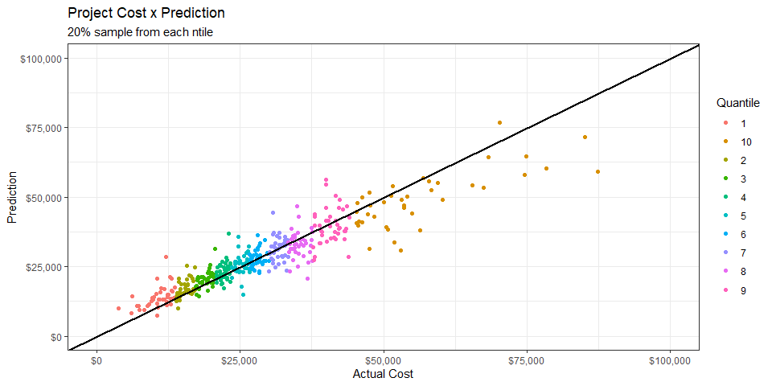<!-- -->
