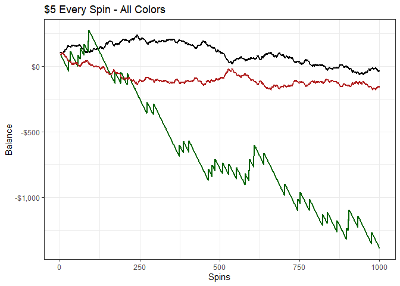
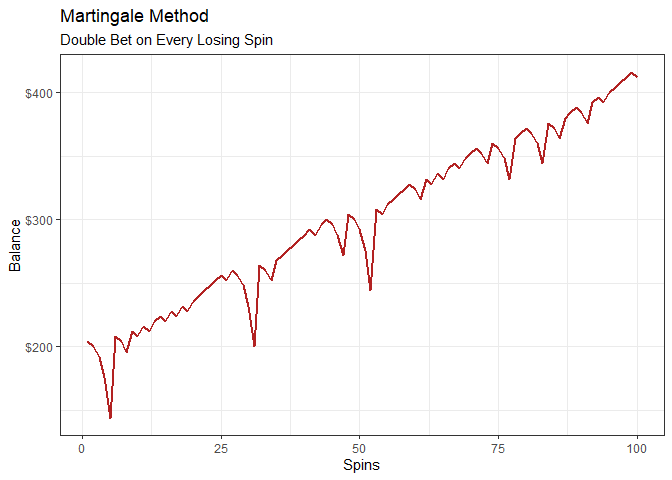
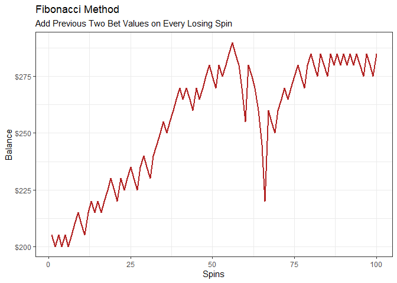
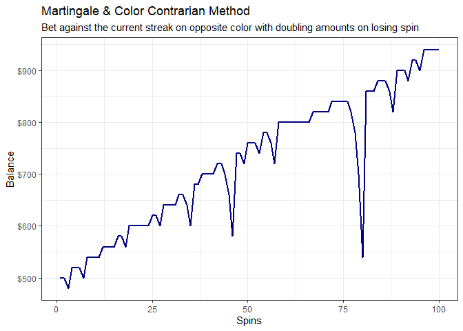

Roulette Simulation and Statistics
================

## Simulation Setup

Starting by randomly selecting each color (with appropriate probability)
to simulate 1000 spins of the wheel. Starting balance is \$100 and
betting increment is \$5. The below table has all info used in the
following few graphs.

``` r
suppressWarnings(library(tidyverse))
```

    ## ── Attaching core tidyverse packages ──────────────────────── tidyverse 2.0.0 ──
    ## ✔ dplyr     1.1.2     ✔ readr     2.1.4
    ## ✔ forcats   1.0.0     ✔ stringr   1.5.0
    ## ✔ ggplot2   3.4.2     ✔ tibble    3.2.1
    ## ✔ lubridate 1.9.2     ✔ tidyr     1.3.0
    ## ✔ purrr     1.0.1     
    ## ── Conflicts ────────────────────────────────────────── tidyverse_conflicts() ──
    ## ✖ dplyr::filter() masks stats::filter()
    ## ✖ dplyr::lag()    masks stats::lag()
    ## ℹ Use the conflicted package (<http://conflicted.r-lib.org/>) to force all conflicts to become errors

``` r
bet_increment = 5
begn_balance = 100

spins = data.frame(
spin_number = paste0(seq(1:1000))) %>% 
mutate(color = sample(c("Black","Red","Green"),
                       nrow(.),
                       prob=c(.4734,.4734,.0532),
                       replace=TRUE)
       ) %>% 
mutate(bet = bet_increment,
       all_green = if_else(color == "Green",bet*17,-bet),
       all_red = if_else(color == "Red",bet,-bet),
       all_black = if_else(color == "Black",bet,-bet),
       green_balance = begn_balance+cumsum(all_green),
       red_balance = begn_balance+cumsum(all_red),
       black_balance = begn_balance+cumsum(all_black),
       spin_number = as.integer(spin_number),
       streak=sequence(rle(color)$lengths) - 1) %>% 
  group_by(color) %>% mutate(freq = n())

spins %>% head(10)
```

    ## # A tibble: 10 × 11
    ## # Groups:   color [2]
    ##    spin_number color   bet all_green all_red all_black green_balance red_balance
    ##          <int> <chr> <dbl>     <dbl>   <dbl>     <dbl>         <dbl>       <dbl>
    ##  1           1 Black     5        -5      -5         5            95          95
    ##  2           2 Black     5        -5      -5         5            90          90
    ##  3           3 Red       5        -5       5        -5            85          95
    ##  4           4 Black     5        -5      -5         5            80          90
    ##  5           5 Red       5        -5       5        -5            75          95
    ##  6           6 Red       5        -5       5        -5            70         100
    ##  7           7 Red       5        -5       5        -5            65         105
    ##  8           8 Black     5        -5      -5         5            60         100
    ##  9           9 Red       5        -5       5        -5            55         105
    ## 10          10 Black     5        -5      -5         5            50         100
    ## # ℹ 3 more variables: black_balance <dbl>, streak <dbl>, freq <int>

To ensure the random sampling is valid, the below graph shows the
distribution of spins by color. This looks to be as expected.

``` r
ggplot(spins %>% distinct(color,freq)) +
  aes(x = reorder(color,-freq), y = freq, fill = color) +
  geom_col() +
  scale_fill_manual(
    values = c(Black = "black",
    Green = "darkgreen",
    Red = "firebrick")
  ) +
  labs(
    x = "Color",
    y = "Frequency",
    title = "Spin Distribution"
  ) +
  theme_bw() +
   guides(fill="none")
```

<!-- -->

A quick check of the consecutive spins for each color is as follows. Red
and black decay at an expected rate for a random event.

``` r
spins %>% 
  group_by(color,streak) %>% 
  summarise(spins = n()) %>% 
  pivot_wider(names_from = color,values_from = spins,values_fill = 0) %>% 
  janitor::adorn_percentages("col") %>% as_tibble() %>% round(2)
```

    ## `summarise()` has grouped output by 'color'. You can override using the
    ## `.groups` argument.

    ## # A tibble: 10 × 4
    ##    streak Black Green   Red
    ##     <dbl> <dbl> <dbl> <dbl>
    ##  1      0  0.5   0.97  0.51
    ##  2      1  0.26  0.03  0.23
    ##  3      2  0.12  0     0.12
    ##  4      3  0.05  0     0.06
    ##  5      4  0.03  0     0.04
    ##  6      5  0.02  0     0.02
    ##  7      6  0.01  0     0.01
    ##  8      7  0     0     0.01
    ##  9      8  0     0     0   
    ## 10      9  0     0     0

### Simulation 1 - Constant Amount

The first simulation considers a constant bet for each spin. Here is \$5
for every spin for black and green.

``` r
ggplot(spins %>% select(spin_number,green_balance,red_balance,black_balance) %>%  pivot_longer(cols = contains("balance"))) +
  aes(x = spin_number, y = value,group=name,color=name) +
  geom_line() +
    scale_color_manual(
    values = c(`green_balance` = "darkgreen",
               `red_balance` = "firebrick",
               `black_balance` = "black")) +
  theme_bw() +
  geom_line(linewidth =1) +
  scale_y_continuous(label=scales::dollar) +
  guides(color="none") +
  labs(
    x = "Spins",
    y = "Balance",
    title = "$5 Every Spin - All Colors"
  )
```

    ## Adding missing grouping variables: `color`

<!-- -->

### Simulation 2 - Martingale

Martingale increases bet amounts after each loss where a win would
offset all previous losses.

First, I create the doubling sequence.

``` r
pascalTriangle <- function(h) {
    lapply(0:h, function(i) choose(i, 0:i))
}

base_bet = 4

triangle = unlist(lapply(pascalTriangle(25), sum)) %>% as.data.frame() %>% mutate(row_number()) %>% 
  rename(factor_increase = 1,spin =2) %>% 
  mutate(bet_amount = base_bet*factor_increase) %>% select(spin,bet_amount)

triangle %>% head(10)
```

    ##    spin bet_amount
    ## 1     1          4
    ## 2     2          8
    ## 3     3         16
    ## 4     4         32
    ## 5     5         64
    ## 6     6        128
    ## 7     7        256
    ## 8     8        512
    ## 9     9       1024
    ## 10   10       2048

I’ll simulate 100 spins of the wheel with a beginning balance of \$200
and a \$4 baseline bet.

``` r
begn_balance = 200

spins = data.frame(
spin_number = paste0(seq(1:100))) %>% 
mutate(color = sample(c("Black","Red","Green"),
                       nrow(.),
                       prob=c(.4734,.4734,.0532),
                       replace=TRUE)
       ) %>% 
mutate(streak = coalesce(case_when(color == "Red" & lag(color) == "Red" ~ 1,
                          color == "Red" & lag(color) != "Red" ~ lag(sequence(rle(color != "Red")$lengths)+1),
                 color != "Red" ~ sequence(rle(color != "Red")$lengths)),1)
       ) %>% 
  left_join(triangle,by=c("streak"="spin")) %>% 
  rename(red_bet = bet_amount) %>% 
  mutate(PL = if_else(color == "Red",red_bet,-red_bet),
       balance = begn_balance+cumsum(PL))

 
spins %>% head(10)
```

    ##    spin_number color streak red_bet PL balance
    ## 1            1 Black      1       4 -4     196
    ## 2            2   Red      2       8  8     204
    ## 3            3 Black      1       4 -4     200
    ## 4            4 Black      2       8 -8     192
    ## 5            5   Red      3      16 16     208
    ## 6            6   Red      1       4  4     212
    ## 7            7   Red      1       4  4     216
    ## 8            8   Red      1       4  4     220
    ## 9            9 Black      1       4 -4     216
    ## 10          10 Black      2       8 -8     208

``` r
ggplot(spins) +
    aes(x = as.integer(spin_number), y = balance) +
    geom_line(color = "firebrick",linewidth =1) +
    theme_bw() +
  scale_y_continuous(label=scales::dollar) +
  scale_x_continuous(label=scales::comma) +
  labs(
    x = "Spins",
    y = "Balance",
    title = "Martingale Method",
    subtitle = "Double Bet on Every Losing Spin"
  )
```

<!-- -->

Show summary stats for bets, running balance, and single spin
profit/loss

``` r
spins %>% 
  summarise(`Max Bet` = max(red_bet),
            `Minimum Balance` = min(balance),
            `Largest Loss (Single Spin)` = min(PL),
            `Largest Win (Single Spin)` = max(PL),
            `Longest Unfavorable Run` = max(streak) - 1,
            `Bet Amount - Median` = median(red_bet),
            `Bet Amount - 75th Percentile` = quantile(red_bet,.75),
            `Bet Amount - 95th Percentile` = quantile(red_bet,.95)
            ) %>% 
  mutate(`Max Drawdown` = -(begn_balance - `Minimum Balance`)) %>% 
  pivot_longer(cols = everything()) %>%
  rename(Metric = 1, Value = 2)
```

    ## # A tibble: 9 × 2
    ##   Metric                        Value
    ##   <chr>                         <dbl>
    ## 1 Max Bet                       256  
    ## 2 Minimum Balance                56  
    ## 3 Largest Loss (Single Spin)   -128  
    ## 4 Largest Win (Single Spin)     256  
    ## 5 Longest Unfavorable Run         6  
    ## 6 Bet Amount - Median             8  
    ## 7 Bet Amount - 75th Percentile   16  
    ## 8 Bet Amount - 95th Percentile   67.2
    ## 9 Max Drawdown                 -144

### Simulation 3 - Fibonacci

Create Fibonacci sequence; each number is the sum of the two preceding
values.

``` r
base_bet = 5

n <- 20
fib <- numeric(n)
fib[1] <- base_bet
fib[2] <- base_bet
for (i in 3:n)
{
  fib[i] <- fib[i-1]+fib[i-2] 
}
fib = data.frame(bet_amount  = fib,spin = seq(1:n)) %>% 
  mutate(rolling_fib_amt = cumsum(bet_amount))

fib
```

    ##    bet_amount spin rolling_fib_amt
    ## 1           5    1               5
    ## 2           5    2              10
    ## 3          10    3              20
    ## 4          15    4              35
    ## 5          25    5              60
    ## 6          40    6             100
    ## 7          65    7             165
    ## 8         105    8             270
    ## 9         170    9             440
    ## 10        275   10             715
    ## 11        445   11            1160
    ## 12        720   12            1880
    ## 13       1165   13            3045
    ## 14       1885   14            4930
    ## 15       3050   15            7980
    ## 16       4935   16           12915
    ## 17       7985   17           20900
    ## 18      12920   18           33820
    ## 19      20905   19           54725
    ## 20      33825   20           88550

``` r
begn_balance = 200

spins = data.frame(
spin_number = paste0(seq(1:100))) %>% 
mutate(color = sample(c("Black","Red","Green"),
                       nrow(.),
                       prob=c(.4734,.4734,.0532),
                       replace=TRUE)
       ) %>% 
mutate(streak = coalesce(case_when(color == "Red" & lag(color) == "Red" ~ 1,
                          color == "Red" & lag(color) != "Red" ~ lag(sequence(rle(color != "Red")$lengths)+1),
                 color != "Red" ~ sequence(rle(color != "Red")$lengths)),1)
       ) %>% 
  left_join(fib,by=c("streak"="spin")) %>% 
  rename(red_bet = bet_amount) %>% 
  mutate(PL = if_else(color == "Red",red_bet,-red_bet),
       balance = begn_balance+cumsum(PL))

spins %>% head(10)
```

    ##    spin_number color streak red_bet rolling_fib_amt PL balance
    ## 1            1 Black      1       5               5 -5     195
    ## 2            2   Red      2       5              10  5     200
    ## 3            3 Black      1       5               5 -5     195
    ## 4            4   Red      2       5              10  5     200
    ## 5            5   Red      1       5               5  5     205
    ## 6            6 Black      1       5               5 -5     200
    ## 7            7 Black      2       5              10 -5     195
    ## 8            8   Red      3      10              20 10     205
    ## 9            9 Black      1       5               5 -5     200
    ## 10          10 Black      2       5              10 -5     195

``` r
ggplot(spins) +
    aes(x = as.integer(spin_number), y = balance) +
    geom_line(color = "firebrick",linewidth =1) +
    theme_bw() +
  scale_y_continuous(label=scales::dollar) +
  scale_x_continuous(label=scales::comma) +
  labs(
    x = "Spins",
    y = "Balance",
    title = "Fibonacci Method",
    subtitle = "Add Previous Two Bet Values on Every Losing Spin"
  )
```

<!-- -->

Show summary stats for bets, running balance, and single spin
profit/loss

``` r
spins %>% 
  summarise(`Max Bet` = max(red_bet),
            `Minimum Balance` = min(balance),
            `Largest Loss (Single Spin)` = min(PL),
            `Largest Win (Single Spin)` = max(PL),
            `Longest Unfavorable Run` = max(streak) - 1,
            `Bet Amount - Median` = median(red_bet),
            `Bet Amount - 75th Percentile` = quantile(red_bet,.75),
            `Bet Amount - 95th Percentile` = quantile(red_bet,.95)
            ) %>% 
  mutate(`Max Drawdown` = -(begn_balance - `Minimum Balance`)) %>% 
  pivot_longer(cols = everything()) %>%
  rename(Metric = 1, Value = 2)
```

    ## # A tibble: 9 × 2
    ##   Metric                         Value
    ##   <chr>                          <dbl>
    ## 1 Max Bet                       105   
    ## 2 Minimum Balance                40   
    ## 3 Largest Loss (Single Spin)    -65   
    ## 4 Largest Win (Single Spin)     105   
    ## 5 Longest Unfavorable Run         7   
    ## 6 Bet Amount - Median             5   
    ## 7 Bet Amount - 75th Percentile    6.25
    ## 8 Bet Amount - 95th Percentile   15.5 
    ## 9 Max Drawdown                 -160

### Simulation 4 - Martindale & Consecutive Color Contrarian

This method combines the Martingale strategy with betting against the
trend. After 2 colors appear in a row, a bet is placed on the opposite
color for \$20, and increases in a doubling sequence (per the Martingale
strategy). 100 spins simulated below with a starting balance of \$500.

``` r
pascalTriangle <- function(h) {
    lapply(0:h, function(i) choose(i, 0:i))
}

base_bet = 20

triangle = unlist(lapply(pascalTriangle(25), sum)) %>% as.data.frame() %>% mutate(row_number()) %>% 
  rename(factor_increase = 1,spin =2) %>% 
  mutate(bet_amount = base_bet*factor_increase) %>% select(spin,bet_amount)

triangle %>% head(10)
```

    ##    spin bet_amount
    ## 1     1         20
    ## 2     2         40
    ## 3     3         80
    ## 4     4        160
    ## 5     5        320
    ## 6     6        640
    ## 7     7       1280
    ## 8     8       2560
    ## 9     9       5120
    ## 10   10      10240

``` r
begn_balance = 500

spins = data.frame(
spin_number = paste0(seq(1:100))) %>% 
mutate(color = sample(c("Black","Red","Green"),
                       nrow(.),
                       prob=c(.4734,.4734,.0532),
                       replace=TRUE)
       ) %>% 
mutate(streak=sequence(rle(color)$lengths) - 1) %>% 
ungroup() %>% 
mutate(prev_run = lag(streak),
       action = case_when(lag(color) != "Green" & prev_run >= 2 ~ "Bet",
                      .default = "No Bet")) %>% 
  replace(is.na(.), 0) %>% 
     left_join(triangle,by=c("prev_run"="spin")) %>% 
  mutate(PL = if_else(color != lag(color),bet_amount,-bet_amount),
    balance = begn_balance+cumsum(coalesce(PL,0)))

spins %>% head(10)
```

    ##    spin_number color streak prev_run action bet_amount  PL balance
    ## 1            1 Black      0        0 No Bet         NA  NA     500
    ## 2            2 Black      1        0 No Bet         NA  NA     500
    ## 3            3 Black      2        1 No Bet         20 -20     480
    ## 4            4   Red      0        2    Bet         40  40     520
    ## 5            5 Black      0        0 No Bet         NA  NA     520
    ## 6            6 Black      1        0 No Bet         NA  NA     520
    ## 7            7 Black      2        1 No Bet         20 -20     500
    ## 8            8 Green      0        2    Bet         40  40     540
    ## 9            9   Red      0        0 No Bet         NA  NA     540
    ## 10          10 Black      0        0 No Bet         NA  NA     540

``` r
ggplot(spins) +
    aes(x = as.integer(spin_number), y = balance) +
    geom_line(color = "navy",linewidth =1) +
    theme_bw() +
  scale_y_continuous(label=scales::dollar) +
  scale_x_continuous(label=scales::comma) +
  labs(
    x = "Spins",
    y = "Balance",
    title = "Martingale & Color Contrarian Method",
    subtitle = "Bet against the current streak on opposite color with doubling amounts on losing spin"
  )
```

<!-- -->

``` r
spins %>% 
  summarise(`Max Bet` = max(bet_amount),
            `Minimum Balance` = min(balance),
            `Largest Loss (Single Spin)` = min(PL,na.rm = T),
            `Largest Win (Single Spin)` = max(PL,na.rm = T),
            `Longest Unfavorable Run` = max(streak,na.rm = T) - 1,
            `Bet Amount - Median` = median(bet_amount,na.rm=T),
            `Bet Amount - 75th Percentile` = quantile(bet_amount,.75,na.rm=T),
            `Bet Amount - 95th Percentile` = quantile(bet_amount,.95,na.rm = T)
            ) %>% 
  mutate(`Max Drawdown` = -(begn_balance - `Minimum Balance`)) %>% 
  pivot_longer(cols = everything()) %>%
  rename(Metric = 1, Value = 2)
```

    ## # A tibble: 9 × 2
    ##   Metric                       Value
    ##   <chr>                        <dbl>
    ## 1 Max Bet                        NA 
    ## 2 Minimum Balance               480 
    ## 3 Largest Loss (Single Spin)   -160 
    ## 4 Largest Win (Single Spin)     320 
    ## 5 Longest Unfavorable Run         4 
    ## 6 Bet Amount - Median            20 
    ## 7 Bet Amount - 75th Percentile   40 
    ## 8 Bet Amount - 95th Percentile  152.
    ## 9 Max Drawdown                  -20
