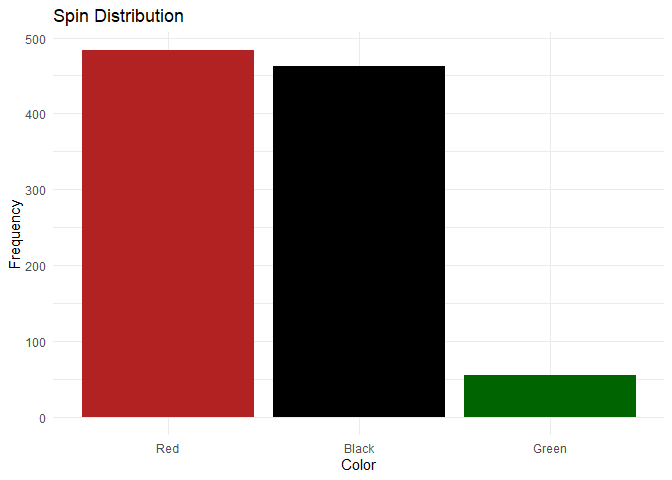
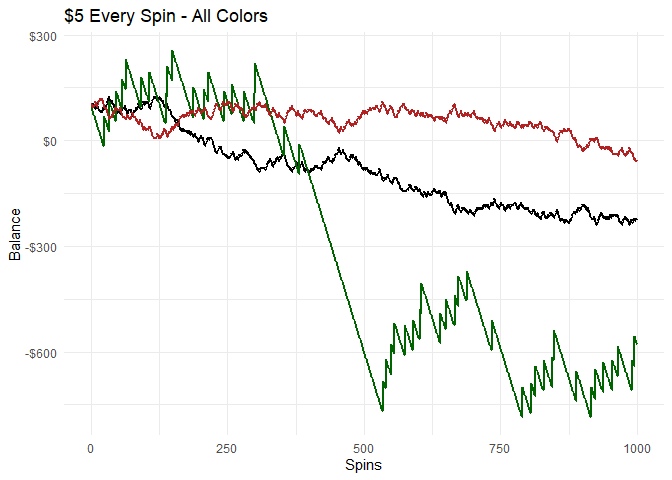
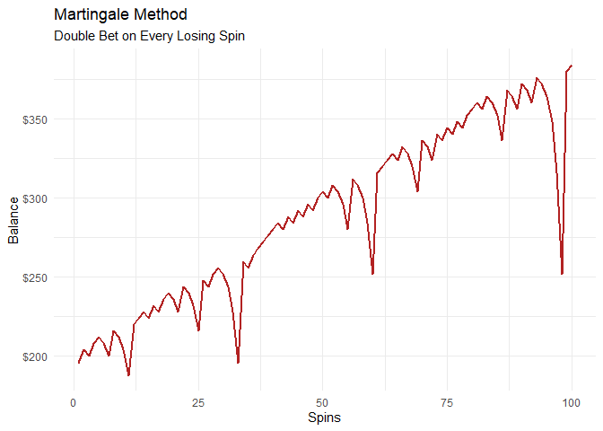
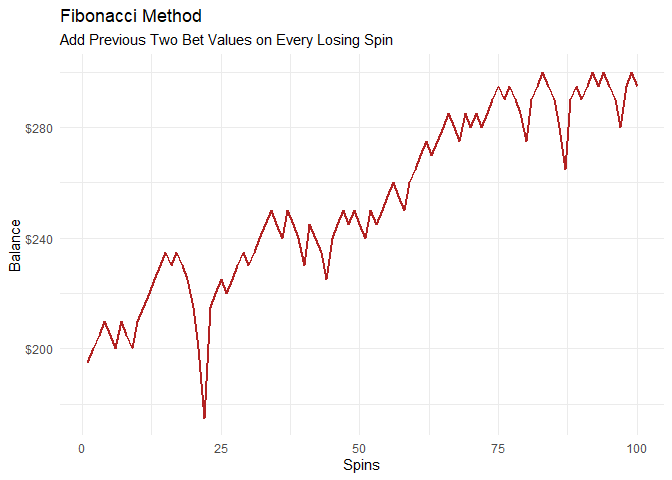
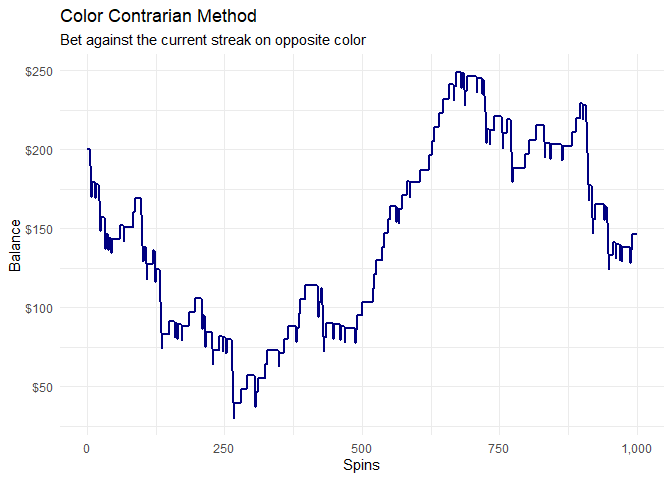

Roulette Simulation and Statistics
================

## Simulation Setup

Starting by randomly selecting each color (with appropriate probability)
to simulate 5000 spins of the wheel. Starting balance is \$100 and
betting increment is \$5. The below table has all info used in the
following few graphs.

``` r
suppressMessages(library(tidyverse))
```

    ## Warning: package 'tidyverse' was built under R version 4.2.3

    ## Warning: package 'tibble' was built under R version 4.2.3

    ## Warning: package 'readr' was built under R version 4.2.3

    ## Warning: package 'dplyr' was built under R version 4.2.3

    ## Warning: package 'forcats' was built under R version 4.2.3

    ## Warning: package 'lubridate' was built under R version 4.2.3

``` r
bet_increment = 5
begn_balance = 100

spins = data.frame(
spin_number = paste0(seq(1:5000))) %>% 
mutate(color = sample(c("Black","Red","Green"),
                       nrow(.),
                       prob=c(.4734,.4734,.0532),
                       replace=TRUE)
       ) %>% 
mutate(bet = bet_increment,
       all_green = if_else(color == "Green",bet*17,-bet),
       all_red = if_else(color == "Red",bet,-bet),
       green_balance = begn_balance+cumsum(all_green),
       red_balance = begn_balance+cumsum(all_red),
       spin_number = as.integer(spin_number),
       streak=sequence(rle(color)$lengths) - 1) %>% 
  group_by(color) %>% mutate(freq = n())

spins %>% head(10)
```

    ## # A tibble: 10 × 9
    ## # Groups:   color [2]
    ##    spin_number color   bet all_green all_red green_balance red_balance streak
    ##          <int> <chr> <dbl>     <dbl>   <dbl>         <dbl>       <dbl>  <dbl>
    ##  1           1 Red       5        -5       5            95         105      0
    ##  2           2 Black     5        -5      -5            90         100      0
    ##  3           3 Black     5        -5      -5            85          95      1
    ##  4           4 Black     5        -5      -5            80          90      2
    ##  5           5 Black     5        -5      -5            75          85      3
    ##  6           6 Red       5        -5       5            70          90      0
    ##  7           7 Black     5        -5      -5            65          85      0
    ##  8           8 Red       5        -5       5            60          90      0
    ##  9           9 Black     5        -5      -5            55          85      0
    ## 10          10 Red       5        -5       5            50          90      0
    ## # ℹ 1 more variable: freq <int>

To ensure the random sampling is correct, the below graph shows the
distribution of spins by color. This looks to be as expected.

``` r
ggplot(spins %>% distinct(color,freq)) +
  aes(x = reorder(color,-freq), y = freq, fill = color) +
  geom_col() +
  scale_fill_manual(
    values = c(Black = "black",
    Green = "darkgreen",
    Red = "firebrick")
  ) +
  labs(
    x = "Color",
    y = "Frequency",
    title = "Spin Distribution"
  ) +
  theme_minimal() +
   guides(fill="none")
```

<!-- -->

A quick check of the consecutive spins for each color is as follows. Red
and black decay at an expected rate for a random event, while the odds
of the wheel landing on 2 greens in a row is \< 5%

``` r
spins %>% 
  group_by(color,streak) %>% 
  summarise(spins = n()) %>% 
  pivot_wider(names_from = color,values_from = spins,values_fill = 0) %>% 
  janitor::adorn_percentages("col") %>% as_tibble() %>% round(2) %>% filter(streak < 6)
```

    ## `summarise()` has grouped output by 'color'. You can override using the
    ## `.groups` argument.

    ## # A tibble: 6 × 4
    ##   streak Black Green   Red
    ##    <dbl> <dbl> <dbl> <dbl>
    ## 1      0  0.52  0.94  0.52
    ## 2      1  0.25  0.05  0.24
    ## 3      2  0.12  0.01  0.11
    ## 4      3  0.06  0     0.06
    ## 5      4  0.02  0     0.03
    ## 6      5  0.01  0     0.02

### Simulation 1 - Constant Amount

The first simulation considers a constant bet for each spin. Here is \$5
for every spin for black and green.

``` r
ggplot(spins %>% select(spin_number,green_balance,red_balance) %>%  pivot_longer(cols = contains("balance"))) +
  aes(x = spin_number, y = value,group=name,color=name) +
  geom_line() +
    scale_color_manual(
    values = c(`green_balance` = "darkgreen",
               `red_balance` = "firebrick")) +
  theme_minimal() +
  geom_line(linewidth =1) +
  scale_y_continuous(label=scales::dollar) +
  guides(color="none") +
  labs(
    x = "Spins",
    y = "Balance",
    title = "$5 Every Spin"
  )
```

    ## Adding missing grouping variables: `color`

<!-- -->

### Simulation 2 - Martingale

Martingale increases bet amounts after each loss where a win would
offset all previous losses.

Create doubling sequence…

``` r
pascalTriangle <- function(h) {
    lapply(0:h, function(i) choose(i, 0:i))
}

base_bet = 5

triangle = unlist(lapply(pascalTriangle(25), sum)) %>% as.data.frame() %>% mutate(row_number()) %>% 
  rename(factor_increase = 1,spin =2) %>% 
  mutate(bet_amount = base_bet*factor_increase) %>% select(spin,bet_amount)

triangle %>% head(10)
```

    ##    spin bet_amount
    ## 1     1          5
    ## 2     2         10
    ## 3     3         20
    ## 4     4         40
    ## 5     5         80
    ## 6     6        160
    ## 7     7        320
    ## 8     8        640
    ## 9     9       1280
    ## 10   10       2560

I’ll simulate 500 spins of the wheel with the same beginning balance and
betting increment as before.

``` r
begn_balance = 100

spins = data.frame(
spin_number = paste0(seq(1:500))) %>% 
mutate(color = sample(c("Black","Red","Green"),
                       nrow(.),
                       prob=c(.4734,.4734,.0532),
                       replace=TRUE)
       ) %>% 
mutate(red_streak = coalesce(case_when(color == "Red" & lag(color) == "Red" ~ 1,
                          color == "Red" & lag(color) != "Red" ~ lag(sequence(rle(color != "Red")$lengths)+1),
                 color != "Red" ~ sequence(rle(color != "Red")$lengths)),1)
       ) %>% 
  left_join(triangle,by=c("red_streak"="spin")) %>% 
  rename(red_bet = bet_amount) %>% 
  mutate(all_red = if_else(color == "Red",red_bet,-red_bet),
       red_balance = begn_balance+cumsum(all_red))

 
spins %>% head(10)
```

    ##    spin_number color red_streak red_bet all_red red_balance
    ## 1            1   Red          1       5       5         105
    ## 2            2 Black          1       5      -5         100
    ## 3            3 Black          2      10     -10          90
    ## 4            4   Red          3      20      20         110
    ## 5            5 Black          1       5      -5         105
    ## 6            6   Red          2      10      10         115
    ## 7            7   Red          1       5       5         120
    ## 8            8   Red          1       5       5         125
    ## 9            9 Black          1       5      -5         120
    ## 10          10   Red          2      10      10         130

``` r
ggplot(spins) +
    aes(x = as.integer(spin_number), y = red_balance) +
    geom_line(color = "firebrick",linewidth =1) +
    theme_minimal() +
  scale_y_continuous(label=scales::dollar) +
  scale_x_continuous(label=scales::comma) +
  labs(
    x = "Spins",
    y = "Balance",
    title = "Martingale Method",
    subtitle = "Double Bet on Every Losing Spin"
  )
```

<!-- -->

``` r
summary(spins %>% select(red_bet,red_balance))
```

    ##     red_bet        red_balance    
    ##  Min.   :  5.00   Min.   :-485.0  
    ##  1st Qu.:  5.00   1st Qu.: 358.8  
    ##  Median : 10.00   Median : 677.5  
    ##  Mean   : 20.64   Mean   : 679.3  
    ##  3rd Qu.: 20.00   3rd Qu.: 991.2  
    ##  Max.   :640.00   Max.   :1330.0

### Simulation 3 - Fibonacci

Create Fibonacci sequence; each number is the sum of the two preceding
values.

``` r
base_bet = 5

n <- 15
fib <- numeric(n)
fib[1] <- base_bet
fib[2] <- base_bet
for (i in 3:n)
{
  fib[i] <- fib[i-1]+fib[i-2] 
}
fib = data.frame(bet_amount  = fib,spin = seq(1:n))

fib
```

    ##    bet_amount spin
    ## 1           5    1
    ## 2           5    2
    ## 3          10    3
    ## 4          15    4
    ## 5          25    5
    ## 6          40    6
    ## 7          65    7
    ## 8         105    8
    ## 9         170    9
    ## 10        275   10
    ## 11        445   11
    ## 12        720   12
    ## 13       1165   13
    ## 14       1885   14
    ## 15       3050   15

``` r
begn_balance = 100

spins = data.frame(
spin_number = paste0(seq(1:500))) %>% 
mutate(color = sample(c("Black","Red","Green"),
                       nrow(.),
                       prob=c(.4734,.4734,.0532),
                       replace=TRUE)
       ) %>% 
mutate(red_streak = coalesce(case_when(color == "Red" & lag(color) == "Red" ~ 1,
                          color == "Red" & lag(color) != "Red" ~ lag(sequence(rle(color != "Red")$lengths)+1),
                 color != "Red" ~ sequence(rle(color != "Red")$lengths)),1)
       ) %>% 
  left_join(fib,by=c("red_streak"="spin")) %>% 
  rename(red_bet = bet_amount) %>% 
  mutate(all_red = if_else(color == "Red",red_bet,-red_bet),
       red_balance = begn_balance+cumsum(all_red))

spins %>% head(10)
```

    ##    spin_number color red_streak red_bet all_red red_balance
    ## 1            1   Red          1       5       5         105
    ## 2            2 Black          1       5      -5         100
    ## 3            3   Red          2       5       5         105
    ## 4            4 Black          1       5      -5         100
    ## 5            5 Green          2       5      -5          95
    ## 6            6 Black          3      10     -10          85
    ## 7            7 Green          4      15     -15          70
    ## 8            8   Red          5      25      25          95
    ## 9            9   Red          1       5       5         100
    ## 10          10 Black          1       5      -5          95

``` r
ggplot(spins) +
    aes(x = as.integer(spin_number), y = red_balance) +
    geom_line(color = "firebrick",linewidth =1) +
    theme_minimal() +
  scale_y_continuous(label=scales::dollar) +
  scale_x_continuous(label=scales::comma) +
  labs(
    x = "Spins",
    y = "Balance",
    title = "Fibonacci Method",
    subtitle = "Add Previous Two Bet Values on Every Losing Spin"
  )
```

<!-- -->

### Simulation 4 - Consecutive Color Contrarian

If the spins are truly random, any run of more than two (zero being the
beginning of a new trend), has very low odds. Next table simulates
betting the opposite color on streaks greater than 1. No action is taken
when green appears more than once.

This method involves taking a betting increment and allocating 90% to
the inverse color and 10% to green as “insurance”. In this case I use a
\$10 increment; \$9 is allotted to the inverse color of the streak, and
\$1 is allocated to green. Simulation is 5,000 spins.

``` r
increment = 10

spins = data.frame(
spin_number = paste0(seq(1:5000))) %>% 
mutate(color = sample(c("Black","Red","Green"),
                       nrow(.),
                       prob=c(.4734,.4734,.0532),
                       replace=TRUE)
       ) %>% 
mutate(streak=sequence(rle(color)$lengths) - 1) %>% 
ungroup() %>% 
mutate(prev_run = lag(streak),
       PL = case_when(lag(color) != color & 
                        lag(color) != "Green" & 
                        color != "Green" &
                        prev_run >= 1 ~ increment - (increment *0.1),
                      
                      lag(color) != color & color == "Green" & prev_run >= 1 ~ ((increment*0.1)*17)-(increment - (increment *0.1)),
                      lag(color) == color & prev_run >= 1 ~ -increment,
                      prev_run < 1 | lag(color) == "Green" ~ 0)) %>% 
  replace(is.na(.), 0) %>% 
  mutate(balance = begn_balance+cumsum(PL))

spins %>% head(10)
```

    ##    spin_number color streak prev_run PL balance
    ## 1            1   Red      0        0  0     100
    ## 2            2 Black      0        0  0     100
    ## 3            3   Red      0        0  0     100
    ## 4            4 Green      0        0  0     100
    ## 5            5 Black      0        0  0     100
    ## 6            6 Black      1        0  0     100
    ## 7            7   Red      0        1  9     109
    ## 8            8 Black      0        0  0     109
    ## 9            9   Red      0        0  0     109
    ## 10          10 Black      0        0  0     109

``` r
ggplot(spins) +
    aes(x = as.integer(spin_number), y = balance) +
    geom_line(color = "navy",linewidth =1) +
    theme_minimal() +
  scale_y_continuous(label=scales::dollar) +
  scale_x_continuous(label=scales::comma) +
  labs(
    x = "Spins",
    y = "Balance",
    title = "Color Contrarian Method",
    subtitle = "Bet against the current streak on opposite color"
  )
```

<!-- -->
